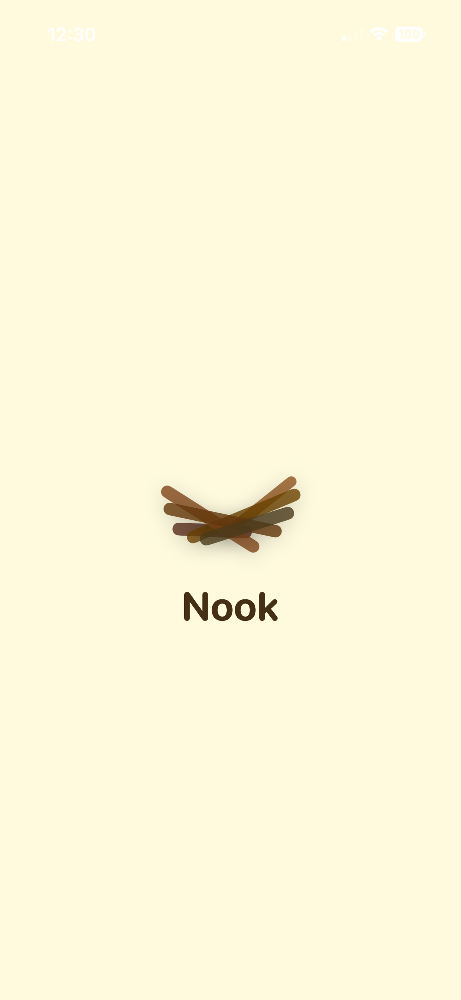
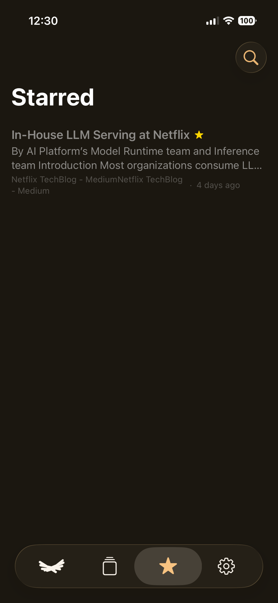
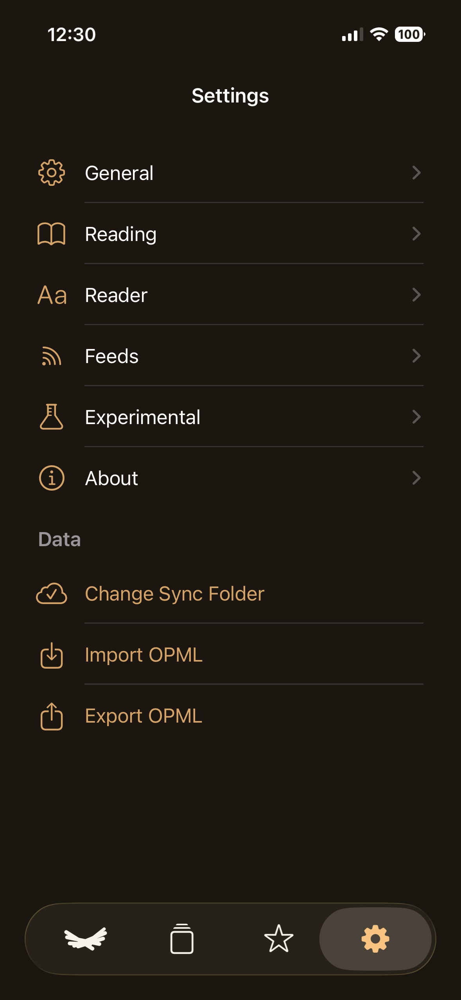

<h1 align="center">
  <br/>
  Nook
</h1>

<p align="center">A small, native RSS reader for macOS and iOS — offline-first, free, and stored in a plain folder on whatever cloud you already use.</p>

<p align="center">
  <a href="https://github.com/selenehyun/nook/releases/latest">
    
  </a>
</p>

<p align="center">
  <a href="https://github.com/selenehyun/nook/releases/latest"></a>
  
  
  
  <a href="https://github.com/selenehyun/nook/stargazers"></a>
  <a href="LICENSE"></a>
</p>

<div align="center">
  <table>
    <tr>
      <td valign="middle"></td>
      <td valign="middle"></td>
    </tr>
  </table>
</div>

> **New to RSS?** RSS lets you follow sites, blogs, and newsletters in one place — no algorithm, no ads, no account, and nothing tracking what you read. You decide what you subscribe to and see everything, in order. [Why use RSS feeds →](https://openrss.org/guides/what-are-rss-feeds#why-use-rss-feeds)

## Why Nook

A bird builds its nest one twig at a time — a small place that's entirely its own. Nook is that idea for reading: gather the writing you care about, one feed at a time, into a space that fits you, and settle in with it comfortably whenever you like.

Nook isn't trying to be special. It's a small, native RSS reader built around a few plain ideas: it works **offline first**, it's **free** and stays out of your way, and it runs **entirely on infrastructure you already have** — your own folder, synced by whatever cloud you already use. There's no server to sign in to and no account to create, and nothing of yours passes through anything the author runs.

Because your library is just a folder, there's **no lock-in**:

- **Any cloud you like.** It's just a folder, so sync it however you already do — iCloud Drive, Dropbox, Google Drive, OneDrive, Syncthing, even a Git repo. Nook doesn't run a server or ask for an account.
- **One library, every device.** Point the Mac and iOS apps at the same folder and your feeds, read state, and stars stay in step — Nook watches the folder and merges another device's changes the moment they arrive, so a read on one device is never overwritten by another.
- **Come and go via OPML.** Import your subscriptions from Reeder, NetNewsWire, Feedly, or anywhere else in seconds — and export them back out any time. Your feed list is always yours to take with you.

## A few things that set it apart

Not better or worse than the other good native readers out there — just a different set of choices, in case they're the ones you're after:

- **No backend, no account.** There's no Nook server and nothing to sign up for. Your whole library is a plain folder you point at, so your data never leaves storage you already trust.
- **Sync without a sync service.** Most readers reach multi-device sync through iCloud, Feedbin, Feedly, and the like. Nook syncs by merging plain files in that folder — conflict-free, so two devices never clobber each other — with no service in between.
- **On-device translation.** When an article isn't in your language, it's translated in place with Apple Intelligence right on your device — no cloud translation call.
- **Free and offline-first.** It's free, and built to be fully usable without a connection; a refresh just tops things up when you're online.

## Features

- 🪶 **Native on every device.** One shared Swift core (`NookKit`) under a SwiftUI + AppKit Mac app and a SwiftUI iPhone/iPad app — `NavigationSplitView`, native toolbars, menus, commands, swipe actions, and share sheets.
- 🗂️ **Your data, your folder — any cloud.** Feeds, articles, bodies, and user state live as plain per-device JSON shards in a folder you pick, Obsidian-vault style. Point it at iCloud Drive, Dropbox, Google Drive, OneDrive — whatever syncs folders for you. No account, no telemetry.
- 🔁 **Conflict-free cross-device sync.** Every device writes only its own content and state files, so two devices can't clobber the same authoritative file. Nook accumulates last-writer-wins CRDT registers in a rebuildable local SQLite cache and republishes learned peer state; delayed, duplicated, missing, or out-of-order cloud files cannot make an observed article disappear.
- 📥 **Painless migration, no lock-in.** Bring subscriptions in from any reader with **OPML import**, and **export** them whenever you want to move on.
- 📰 **Real feeds.** Add an RSS/Atom URL, or just paste a website — Nook auto-discovers the feed from the page's `<link rel="alternate">`.
- 📲 **Add from anywhere (iOS).** Share a page from Safari with **“Add Feed to Nook”** and it finds and subscribes to that site's feed.
- 🌏 **Natural translation (iOS & macOS).** When an article isn't in your language, translate it in place — powered by **Apple Intelligence** on-device for fluent, idiomatic results (with the system Translation engine as a fallback). Text types in top to bottom, each block streaming over the original like a live rewrite, while the page's own layout, links, and formatting stay intact. Nook reads the article's subject first, keeps names, brands, and technical terms verbatim, and holds one consistent tone throughout — in both the native reader and the in-app web view.
- 📚 **Smart sources & folders.** Jump between **Unread**, **Today**, **Starred**, and **All Articles**, or organize feeds into your own folders (create, rename, delete).
- 📖 **Two ways to read.** A clean, fast native reader by default; opt into a full-page reader (a `WKWebView` with an injected readability script) or pop the original page open in an in-app browser — per feed, if you like.
- ✋ **Gesture-friendly (iOS).** Swipe to read/star, pull to refresh (all feeds or just the one you're viewing), and use the article body itself — double-tap to star, press-and-hold (with a haptic build-up) to open the web view.
- 🔎 **Instant search** across titles, summaries, and feed names, with keyboard-first navigation on the Mac.
- 🔄 **Quiet auto-sync.** Refreshes on a schedule and whenever the app launches or returns to the foreground — throttled so it never hammers your feeds. Automatic refreshes run quietly at low priority and slip new articles in without jolting the list, while an explicit refresh fetches fast; you can even add a feed mid-refresh.
- 🔴 **Unread badges.** A Dock badge on the Mac and an app-icon badge on iOS (showing your total unread), plus a home-screen widget with smart-source shortcuts.
- 🔔 **Smart new-article alerts.** A local notification when genuinely new articles arrive — never for ones you've already seen in the list. That "seen" state syncs across devices, so catching up on your Mac won't re-ping your iPhone. Each device still keeps its own at-most-once receipts, and iOS Settings has a test notification plus background-refresh diagnostics (and a nudge to turn on Background App Refresh if it's off).
- 🌓 **Adaptive icon** (light/dark) and a **localized UI** — English, 한국어, 日本語, 简体中文.
- ⬆️ **Auto-updates** on macOS via [Sparkle](https://sparkle-project.org) — quiet, never a modal.

## On iPhone & iPad

<table>
  <tr>
    <td width="240" align="center"></td>
    <td valign="top">
      <h3>Everything to read, in one place</h3>
      <p>Open straight to the article list. Switch <strong>Unread</strong>, <strong>Today</strong>, or <strong>All</strong> from the segmented control in the navigation bar, and swipe a row to mark it read or star it.</p>
    </td>
  </tr>
</table>

<table>
  <tr>
    <td valign="top">
      <h3>A clean, native reader</h3>
      <p>Articles render as real native text — typography, images, code blocks, quotes, and tables — not a webview. Translate in place with on-device Apple Intelligence, or jump to the full-page reader or the original site when you want.</p>
    </td>
    <td width="240" align="center"></td>
  </tr>
</table>

<table>
  <tr>
    <td width="240" align="center"></td>
    <td valign="top">
      <h3>Flip between articles with a pull</h3>
      <p>Pull past the top or bottom of an article to jump to the previous or next one. It takes a firm, deliberate pull held for a moment, so a stray scroll never flips the article by accident.</p>
    </td>
  </tr>
</table>

<table>
  <tr>
    <td valign="top">
      <h3>Feeds and folders</h3>
      <p>Add an RSS/Atom URL or just paste a website — Nook finds the feed from the page. Group your subscriptions into folders, rename and reorganize, right from the phone.</p>
    </td>
    <td width="240" align="center"></td>
  </tr>
</table>

<table>
  <tr>
    <td width="240" align="center"></td>
    <td valign="top">
      <h3>Keep the good ones</h3>
      <p>Star an article from a swipe or a double-tap on its body, and find everything you saved under the Starred tab.</p>
    </td>
  </tr>
</table>

<table>
  <tr>
    <td valign="top">
      <h3>Make it yours</h3>
      <p>Appearance, reader font and spacing, per-feed reading mode, OPML import/export, and an Experimental section — all as native iOS settings.</p>
    </td>
    <td width="240" align="center"></td>
  </tr>
</table>

## Install

### macOS (Homebrew)

```sh
brew install --cask selenehyun/tap/nook
```

Nook is ad-hoc signed (not notarized), so on first launch either right-click **Nook** in Applications → **Open**, or install without quarantine so it opens straight away:

```sh
HOMEBREW_CASK_OPTS="--no-quarantine" brew install --cask selenehyun/tap/nook
```

Updates thereafter come through the app itself (Sparkle).

### macOS (DMG)

1. Download the latest **[Nook DMG](https://github.com/selenehyun/nook/releases/latest)**.
2. Open it and drag **Nook** into **Applications**.
3. On first launch, macOS Gatekeeper will warn that the app is from an unidentified developer — Nook is ad-hoc signed (not notarized). To open it:
   - **Right-click** `Nook.app` → **Open** → **Open**, or
   - run once in Terminal:
     ```sh
     xattr -dr com.apple.quarantine /Applications/Nook.app
     ```
4. Point Nook at a **sync folder** — any folder your cloud of choice keeps in sync. That's where your library lives.

> Requires **macOS 26 (Tahoe)** or later. Universal binary (Apple Silicon + Intel). On-device Apple Intelligence translation needs an Apple Silicon Mac with Apple Intelligence enabled; elsewhere translation falls back to the system Translation overlay.

### iOS / iPadOS

There's no App Store build yet (that needs a paid Apple Developer account). To run it on your own device, build from source in Xcode:

1. Open `Nook.xcodeproj`, select the **NookiOS** scheme and your device.
2. Set your team under **Signing & Capabilities**, then press **⌘R**.
3. Point it at the **same sync folder** as your Mac (via the Files app — iCloud Drive works well) to share one library.

> Requires **iOS/iPadOS 18** or later. On-device Apple Intelligence translation needs a supported device running **iOS 26**.

## Moving in (and out)

Nook is built so you're never trapped:

- **Switching to Nook?** Export an OPML from your current reader, then **Import OPML** in Nook. Your feeds and folders come across in one step.
- **Switching away?** **Export OPML** and take your list anywhere.
- **Moving devices or clouds?** Move the sync folder. The per-device JSON shards are authoritative; Nook rebuilds its local SQLite cache from them. Legacy `NookLibrary.json` files can stay in place for read-only migration compatibility.

## How your data is stored

Nook is folder-first. Pick any folder — on any cloud, or none — and Nook keeps everything there:

```
YourSyncFolder/
├── NookLibrary.json        # legacy v1 input; current Nook never writes it
├── NookContent.json        # legacy v1 body input; current Nook never writes it
├── .nook/
│   ├── content/
│   │   └── <deviceID>.json # feed/article metadata CRDT
│   ├── bodies/
│   │   └── <deviceID>.json # bounded, regenerable article-body cache
│   └── state/
│       └── <deviceID>.json # read/starred/folder/feed tombstone CRDT
└── Icons/                  # cached feed favicons
```

Since it's just files in a folder you control, "sync" is whatever your folder already does: iCloud Drive across your Apple devices, Dropbox/Google Drive/OneDrive across platforms, or your own backup.

The split is deliberate. Content metadata and mutable user state are separate CRDTs, and **each device writes only its own shard in each directory**. Incoming registers merge by hybrid logical clock, while article membership is grow-only; only an explicit feed tombstone can remove a feed and its articles. Nook's Application Support database transactionally accumulates observed registers, notification receipts, and a publish outbox. It is a disposable cache, not another source of truth.

`NookLibrary.json` and `NookContent.json` are now legacy inputs. Current Nook versions continuously add-import unseen v1 feed/article IDs (including unresolved conflict copies), never let an old payload overwrite v2 content, never interpret a shrinking file as deletion, and never write or resolve those files. This lets a v1 device coexist while upgraded devices remain stable. A v1 app can still have its old shared-file race until it is upgraded; once every device runs v2, no Nook process writes a shared content file.

On the first v2 run, legacy folders, feed placement, read flags, and stars are copied into missing state registers before the new content snapshot is shown. Existing shard edits are never overwritten, and the migration is marked complete only after the state shard is durably written.

File presentation and modification dates are wake-up hints only. Every wake performs an idempotent scan, and a missing, corrupt, partially downloaded, or older-generation peer file means “no new information,” never “delete local information.”

## Auto-updates (macOS)

Nook updates itself with [Sparkle](https://sparkle-project.org), tuned to stay out of your way: background checks **never** pop a modal — not even at launch. When a new version is ready, a small blue chip appears at the bottom of the sidebar. Click it to see what's new and install; keep reading if you don't. Updates are EdDSA-signed and published automatically from GitHub Releases. (On iOS, updates come from rebuilding in Xcode or, in future, the App Store.)

## Keyboard shortcuts (macOS)

| Shortcut | Action |
| --- | --- |
| `↑` / `↓` | Move through the article list |
| `Return` | Open the selected article in the web view |
| `⌘ ↓` / `⌘ ↑` | Next / previous article |
| `⌘ R` | Refresh all feeds |
| `⌘ ⇧ M` | Mark selected as read |
| `⌘ ⇧ S` | Star selected |
| `⌘ ⇧ F` | Toggle reader / original page |
| `⌘ F` | Search articles |
| `⌘ ,` | Settings |

## Build from source

```sh
git clone https://github.com/selenehyun/nook
cd nook
make build          # macOS — or open Nook.xcodeproj and press ⌘R

# iOS (simulator)
xcodebuild -project Nook.xcodeproj -scheme NookiOS \
  -destination 'generic/platform=iOS Simulator' build
```

**Toolchain:** Xcode 26.5+, Swift 6, deployment targets macOS 26 / iOS 18. A macOS build you compile locally isn't quarantined, so it launches without the Gatekeeper prompt.

## Tech

- **Shared core:** `NookKit`, a local Swift package with the store, models, RSS/Atom + OPML parsing, storage, and the reader — used by both apps.
- **UI:** SwiftUI + AppKit on macOS, SwiftUI on iOS/iPadOS (native split view, toolbars, menus, commands, widget, share extension).
- **Networking & parsing:** `URLSession` + `XMLParser` for RSS/Atom and OPML.
- **Reader mode:** `WKWebView` with a self-contained injected readability script.
- **Translation (iOS & macOS):** Apple's on-device **Foundation Models** (Apple Intelligence) — a marker-based engine translates each block in place preserving inline markup (links, emphasis), streaming token by token. It detects the article's subject, grows a keep-verbatim glossary of names and terms, pins one target-language register, splits long paragraphs at sentence boundaries, and validates every result — rejecting untranslated echoes, repetition loops, and mangled markup, and re-translating as needed. A **Translation** framework fallback covers devices without Apple Intelligence; language detection via **NaturalLanguage**.
- **Sync:** per-device content/body/state shards; state-based last-writer-wins CRDTs with hybrid logical clocks; a system SQLite3 replica/outbox cache; `NSFileCoordinator` + `NSFilePresenter` as coordinated I/O and rescan hints.
- **Widget:** WidgetKit. **Updates (macOS):** Sparkle (EdDSA-signed appcast, built and published by GitHub Actions).
- No third-party UI frameworks. No Electron.

## Releasing (maintainers)

Pushing a version tag builds, signs, and publishes the macOS app via `.github/workflows/release.yml`:

```sh
git tag v0.1.8
git push origin v0.1.8
```

The macOS runner archives a universal ad-hoc build, packages a styled DMG, publishes a GitHub Release with the DMG, then EdDSA-signs the update and updates the Sparkle appcast on the `gh-pages` branch.

## License

[MIT](LICENSE) © 2026 Tim.
