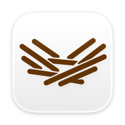
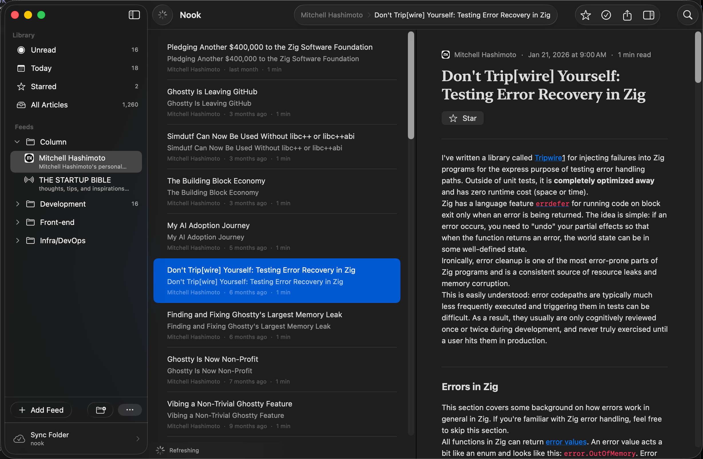

<h1 align="center">
  <br/>
  Nook
</h1>

<p align="center">A native macOS RSS reader that keeps your feeds in a plain folder — on whatever cloud you already use.</p>

<p align="center">
  <a href="https://github.com/selenehyun/nook/releases/latest">
    
  </a>
</p>

<p align="center">
  <a href="https://github.com/selenehyun/nook/releases/latest"></a>
  
  
  <a href="https://github.com/selenehyun/nook/stargazers"></a>
  <a href="LICENSE"></a>
</p>

<p align="center">
  
</p>

## Why Nook

Most RSS readers are either a web app behind a login or an Electron shell pretending to be native. Nook is neither. It's a real SwiftUI/AppKit Mac app, and it stores **all** of your data in a plain folder you choose.

That one decision means **no lock-in**:

- **Any cloud you like.** It's just a folder, so sync it however you already do — iCloud Drive, Dropbox, Google Drive, OneDrive, Syncthing, even a Git repo. Nook doesn't run a server or ask for an account.
- **Come and go via OPML.** Import your subscriptions from Reeder, NetNewsWire, Feedly, or anywhere else in seconds — and export them back out any time. Your feed list is always yours to take with you.

## Features

- 🪶 **Truly native.** SwiftUI + AppKit — `NavigationSplitView`, native toolbars, menus, commands, and share sheets. Not a webview wrapper, not Electron.
- 🗂️ **Your data, your folder — any cloud.** Feeds, articles, read/starred state, and refresh metadata live as plain JSON (`NookLibrary.json`) in a folder you pick, Obsidian-vault style. Point it at iCloud Drive, Dropbox, Google Drive, OneDrive — whatever syncs folders for you. No account, no telemetry.
- 📥 **Painless migration, no lock-in.** Bring subscriptions in from any reader with **OPML import**, and **export** them whenever you want to move on.
- 📰 **Real feeds.** Add an RSS/Atom URL, or just paste a website — Nook auto-discovers the feed from the page's `<link rel="alternate">`.
- 📚 **Smart sources & folders.** Jump between **Unread**, **Today**, **Starred**, and **All Articles**, or organize feeds into your own folders.
- 📖 **Two ways to read.** A clean, fast native reader by default; opt into a full-page reader (a `WKWebView` with an injected readability script) or pop the original page open in an in-app browser sheet.
- 🔎 **Instant search** across titles, summaries, and feed names, with keyboard-first navigation.
- 🔄 **Quiet auto-sync.** Refreshes on a schedule and whenever the app launches or returns to the foreground — throttled so it never hammers your feeds.
- 🔴 **Unread badge & widget.** A Dock badge for total unread and a home-screen widget with smart-source shortcuts.
- 🌓 **Adaptive icon** (light/dark) and a **bilingual UI** (English / 한국어).
- ⬆️ **Auto-updates** via [Sparkle](https://sparkle-project.org) — quiet, never a modal.

## Install

1. Download the latest **[Nook DMG](https://github.com/selenehyun/nook/releases/latest)**.
2. Open it and drag **Nook** into **Applications**.
3. On first launch, macOS Gatekeeper will warn that the app is from an unidentified developer — Nook is ad-hoc signed (not notarized). To open it:
   - **Right-click** `Nook.app` → **Open** → **Open**, or
   - run once in Terminal:
     ```sh
     xattr -dr com.apple.quarantine /Applications/Nook.app
     ```
4. Point Nook at a **sync folder** — any folder your cloud of choice keeps in sync. That's where your library lives.

> Requires **macOS 26 (Tahoe)** or later. Universal binary (Apple Silicon + Intel).

## Moving in (and out)

Nook is built so you're never trapped:

- **Switching to Nook?** Export an OPML from your current reader, then **Subscriptions → Import OPML** in Nook. Your feeds and folders come across in one step.
- **Switching away?** **Subscriptions → Export OPML** and take your list anywhere.
- **Moving Macs or clouds?** Just move the sync folder. Because everything is in `NookLibrary.json`, there's nothing else to migrate.

## How your data is stored

Nook is folder-first. Pick any folder — on any cloud, or none — and Nook keeps everything there:

```
YourSyncFolder/
└── NookLibrary.json      # feeds, articles, read & starred state, refresh metadata
```

Since it's just a file in a folder you control, "sync" is whatever your folder already does: iCloud Drive across your Macs, Dropbox/Google Drive/OneDrive across platforms, or your own backup. `NookLibrary.json` is treated as user data and evolves with backward-compatible migrations.

## Auto-updates

Nook updates itself with [Sparkle](https://sparkle-project.org), tuned to stay out of your way: background checks **never** pop a modal — not even at launch. When a new version is ready, a small blue chip appears at the bottom of the sidebar. Click it to see what's new and install; keep reading if you don't. Updates are EdDSA-signed and published automatically from GitHub Releases.

## Keyboard shortcuts

| Shortcut | Action |
| --- | --- |
| `↑` / `↓` | Move through the article list |
| `Return` | Open the selected article in the web view |
| `⌘ ↓` / `⌘ ↑` | Next / previous article |
| `⌘ R` | Refresh all feeds |
| `⌘ ⇧ M` | Mark selected as read |
| `⌘ ⇧ S` | Star selected |
| `⌘ ⇧ F` | Toggle reader / original page |
| `⌘ F` | Search articles |
| `⌘ ,` | Settings |

## Build from source

```sh
git clone https://github.com/selenehyun/nook
cd nook
make build          # or: open Nook.xcodeproj and press ⌘R
```

**Toolchain:** Xcode 26.5+, Swift 6, deployment target macOS 26. A build you compile locally isn't quarantined, so it launches without the Gatekeeper prompt.

## Tech

- **UI:** SwiftUI + AppKit (native split view, toolbars, menus, commands, widget)
- **Networking & parsing:** `URLSession` + `XMLParser` for RSS/Atom and OPML
- **Reader mode:** `WKWebView` with a self-contained injected readability script
- **Widget:** WidgetKit
- **Updates:** Sparkle (EdDSA-signed appcast, built and published by GitHub Actions)
- No third-party UI frameworks. No Electron.

## Releasing (maintainers)

Pushing a version tag builds, signs, and publishes everything via `.github/workflows/release.yml`:

```sh
git tag v0.1.8
git push origin v0.1.8
```

The macOS runner archives a universal ad-hoc build, packages a styled DMG, publishes a GitHub Release with the DMG, then EdDSA-signs the update and updates the Sparkle appcast on the `gh-pages` branch.

## License

[MIT](LICENSE) © 2026 Tim.
