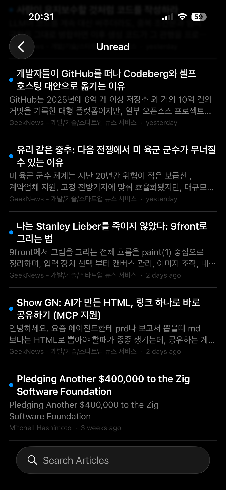
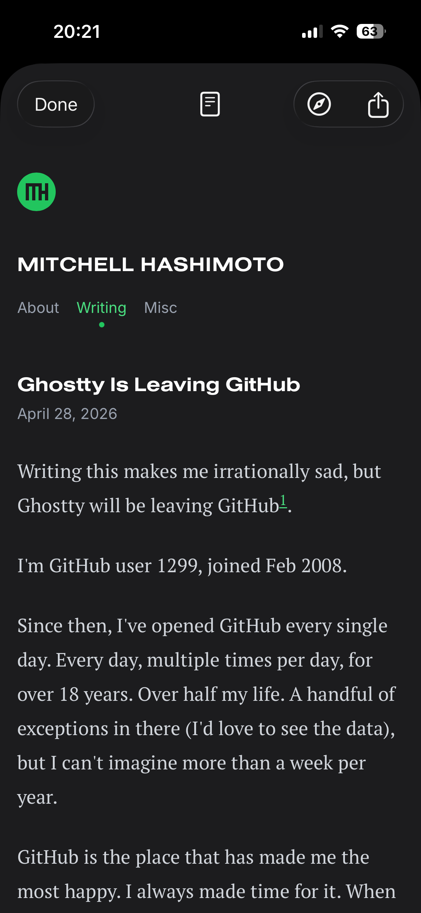
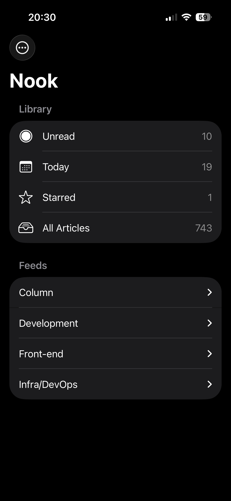

# Features and controls

Nook aims to be quiet by default and explicit about features that use notifications, background work, or external AI. This page describes the current implementation on macOS and iOS.

## At a glance

### Library and sync

- Add an RSS or Atom URL, or paste a website and let Nook discover its `<link rel="alternate">` feed.
- On iOS, share a page from Safari to **Add Feed to Nook**.
- Import and export subscriptions and folders with OPML.
- Use Unread, Today, Starred, All Articles, Downloaded, and Filtered smart sources.
- Organize feeds into folders and articles into color-coded categories.
- Search titles, summaries, and feed names.
- Sync feeds, read state, stars, categories, filters, folders, and feed preferences through a user-selected folder.
- Merge concurrent device changes using per-device CRDT files rather than a single shared file.

The cloud provider and Nook have separate roles: iCloud Drive, Dropbox, or another folder service transports files; Nook's CRDT layer merges the files after they arrive. See [Data and sync](data-and-sync.md).

### Reading

- Read in a native renderer with typography, inline styling, links, images, video and audio destinations, code blocks, quotes, nested lists, and tables.
- Normalize spacing based on semantic block relationships so feed HTML reads more like a deliberately typeset article.
- Switch per feed between the native reader, a full-article `WKWebView` reader, and the original page.
- Customize font, size, line height, letter spacing, background, and text color.
- Copy or save the source body — or the currently visible Gemini Markdown translation — as Markdown. Headings, styling, links, images, quotes, code, lists, tables, and media destinations are preserved.
- On iOS, pull deliberately beyond the top or bottom boundary to change articles; swipe rows to mark read or starred; optionally use a long press to open the browser.
- Choose specific articles to download for offline reading and configure when downloads expire.

### Translation

Translation providers are chosen independently for full articles, list titles, and AI categorization.

- **Apple Intelligence:** on-device and free, when Foundation Models are available.
- **Gemini:** opt-in, network-backed, and uses an API key stored in this device's Keychain. The key is not placed in the sync folder or synced to another device.
- **System Translation:** fallback overlay on devices where the on-device model is unavailable.

In the native reader, the Gemini path translates an ordinary Markdown document rather than transporting custom Nook block markers. Headings, lists, tables, links, and code retain shared context. The response is parsed away from the UI thread and revealed progressively; complete Markdown formatting appears as soon as it is safe to render. Flash Lite is tried first, and an interrupted, incomplete, or structurally invalid result is retried as a whole document with Flash.

The Apple Intelligence path preserves native block structure and inline markup, detects subject context and protected terms, and validates results against echoes, repetition, leaked instructions, and damaged markup.

List-title translation expands a row and reveals the translated title beneath the original. Only visible titles are queued, and results are cached.

### Categories, filters, and rules

- Create categories with a name, color, and optional keyword rules.
- Apply or remove categories manually.
- Optionally classify new articles by meaning with Apple Intelligence or Gemini.
- Run classification once over existing or uncategorized articles.
- Prefer a single primary subject; incidental names, acronyms, organizations, and passing political references should not create unrelated categories.
- Hide a category from normal lists and unread counts.
- Create text filters and collect excluded articles under Filtered rather than deleting them.

### Refresh, badges, and notifications

- Refresh on launch, foreground return, pull-to-refresh, or a configurable schedule.
- Background refreshes use lower priority and merge new items without jolting the visible list.
- Show the total unread count on the macOS Dock and iOS app icon, or turn the badge off.
- Opt into new-article notifications separately from unread badges.
- Synchronize seen state so an article noticed on one device does not produce a later new-article alert on another.
- Keep device-local delivery receipts so the same device alerts at most once for an article.
- Treat a Mac as engaged only while the app and reader window are active, visible, the login session is awake, and system input has occurred within ten minutes. Otherwise iOS background refresh can own the alert even if Nook remains open on the Mac.
- Open smart sources from the iOS home-screen widget.

iOS controls the exact background refresh schedule, so notifications are best effort rather than an exact polling promise. Settings includes authorization and background-refresh diagnostics plus a test notification.

### Platform fit and appearance

- Use native split views, toolbars, menus, keyboard commands, swipe actions, share sheets, and platform settings.
- Follow light and dark appearance with an adaptive app icon.
- Use Nook in English, 한국어, 日本語, or 简体中文.
- Receive quiet in-app updates through Sparkle on macOS.

## Defaults and user control

“Local” below means a preference or cache belongs to that app installation. Shared library data is written to the selected sync folder.

| Capability | Default | Scope and behavior | Network or privacy impact |
| --- | --- | --- | --- |
| Automatic feed refresh | On, every 30 minutes | Local schedule; also refreshes at launch and foreground return | Fetches subscribed feeds |
| Native reader content extraction | On | Local experimental preference; falls back to feed content when extraction fails | Fetches the article page when full content is needed |
| Mark read on open | On, after 3 seconds | Local reading preference | None |
| Unread app-icon or Dock badge | On | Local toggle; count comes from the merged library | iOS requires notification authorization for app-icon badges |
| New-article notifications | Off | Opt-in on each platform; iOS also requires notification permission and Background App Refresh | Background feed requests; local notifications only |
| Full-article translation | On demand | Runs only when the reader's Translate action is used | Apple stays on-device; Gemini sends article text to Google |
| Translation provider | Apple Intelligence | Selected independently for reader, list titles, and categorization | Gemini requires explicit selection and a device-local API key |
| Automatic list-title translation | Off | Opt-in; only visible titles are translated and cached | Depends on the selected title provider |
| Coherent long-article translation | Off | Experimental rolling-context mode for the Apple block path | Depends on the selected reader provider |
| AI categorization | Off | Opt-in; keyword and manual categories work without AI | Apple stays on-device; Gemini sends title and summary to Google |
| Category hiding and text filters | Off until configured | Rules sync as user state; matching articles remain recoverable under Filtered | None |
| Offline full-article downloads | Manual selection | Device-local copies; default auto-expiry is two weeks | Fetches selected article pages |
| Long press to open browser on iOS | Off | Local gesture preference | Opens the selected page when used |

## iPhone and iPad

<table>
  <tr>
    <td width="240" align="center"></td>
    <td valign="top"><strong>Everything to read, in one place.</strong> Switch smart sources from the navigation bar, search, and swipe a row to mark it read or star it.</td>
  </tr>
  <tr>
    <td valign="top"><strong>A native article surface.</strong> Read formatted text, images, code, quotes, lists, and tables; translate in place; or copy and save the body as Markdown.</td>
    <td width="240" align="center"></td>
  </tr>
  <tr>
    <td width="240" align="center"></td>
    <td valign="top"><strong>Flip with a deliberate pull.</strong> Pull past the top or bottom boundary and hold briefly so an ordinary scroll does not change the article.</td>
  </tr>
  <tr>
    <td valign="top"><strong>Feeds and folders.</strong> Add a feed or website, group subscriptions, import or export OPML, and choose a reading mode per feed.</td>
    <td width="240" align="center"></td>
  </tr>
</table>

## macOS keyboard shortcuts

| Shortcut | Action |
| --- | --- |
| `↑` / `↓` | Move through the article list |
| `Return` | Open the selected article in the web view |
| `⌘ ↓` / `⌘ ↑` | Next / previous article |
| `⌘ R` | Refresh all feeds |
| `⌘ ⇧ M` | Mark selected as read |
| `⌘ ⇧ S` | Star selected |
| `⌘ ⇧ F` | Toggle reader / original page |
| `⌘ F` | Search articles |
| `⌘ ,` | Settings |

## macOS updates

Sparkle checks quietly in the background and does not present a modal at launch. When an update is ready, a small chip appears in the sidebar; the reader can install it when convenient. Releases and the appcast are EdDSA-signed.
